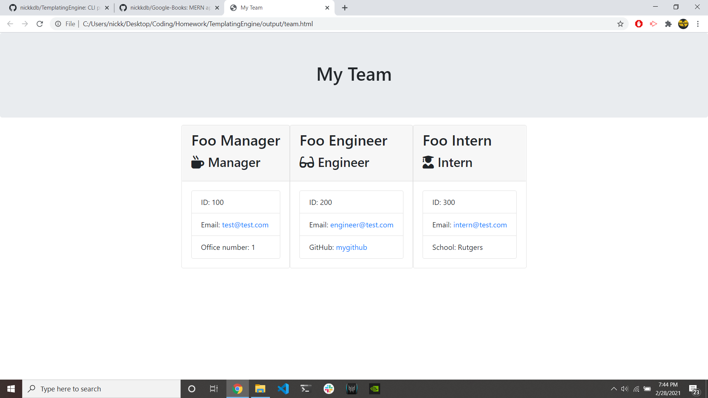

 # Employee Summary Template Engine
    
## Table of Contents
- [License](#License)
- [Description](#Description)
- [Installation](#Installation)
- [Usage](#Usage)
- [Testing](#Testing)
- [Contributing](#Contributing)
- [Questions](#Questions)

    
## License
>  - this project is protected through the MIT license

## Description
> This program allows a user to input information about employees from different roles within the company and have an HTML generated for them displaying the information they input. This project runs from the command line and was built using inquirer, fs, JSES6 classes for employee structures, and jest for testing.

## Installation
> To install this program, clone the repo to your local machine, navigate to the directory it was installed in, and run "npm install" from your terminal to install the necessary dependencies for the application to function

## Usage
> To use this program run the command "node app.js" from the directory which the program was cloned to, from there, follow the on screen instructions to complete the generation of your html file. You will find your outputted results in the 'output' folder, under the filename 'team.html'

## Testing
> To test this project, navigate to the folder that it was cloned to. From your terminal, you can run the command "npm run test" which will go through each employee type and insert test cases, which will verify the functionality of the program.

## Contributions
> If you would like to contribute to this program, please use the information found below to contact me and discuss further.

## Questions
To reach me with additional questions:
>
> Find me on [GitHub](https://github.com/nickkdb)
>
> Send me an [Email](mailto:nborges.dev@gmail.com)

